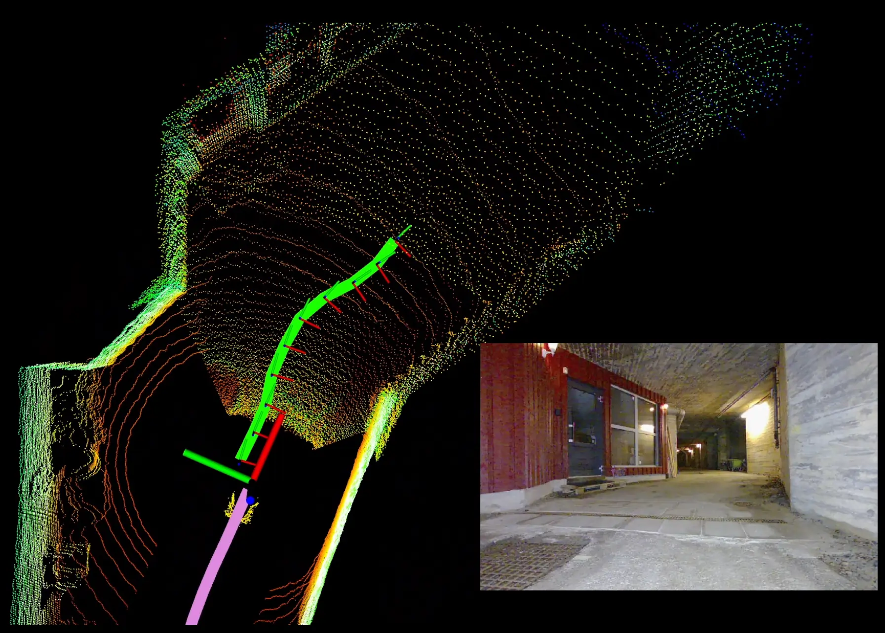
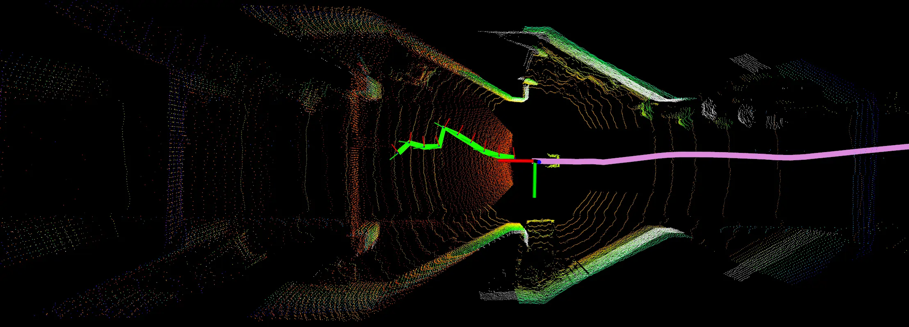
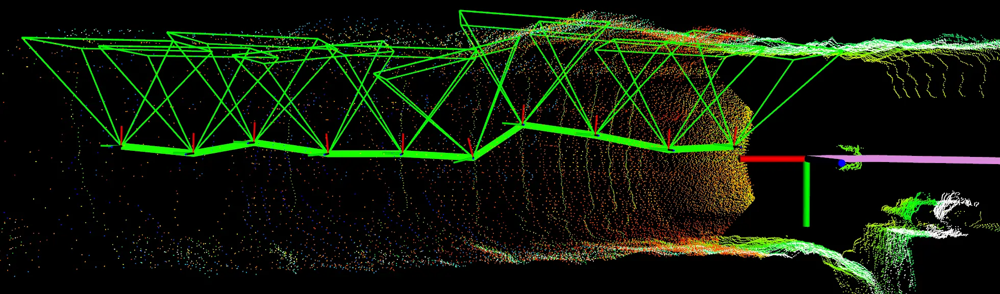

<div align="center">
    <h1>A Reactive View Planner For Mobile Robots</h1>
    <a href="#"></a>
       <a href="#"></a>  
    <a href="#"></a>
     <a href="#"></a>
    <br />
    <br />
    <p><strong><em></em></strong></p>
</div>





This codebase contains the core implementation of the First Look Inspection Planner developed as part of the research pursued in my doctoral thesis *On Adaptive and Scene-Aware Inspection Autonomy*.

The codebase has been tested on Quadrupedal robots (SPOT), Ground robots (Husky) and Aerial robots (Shafter). The method has been extensively validated across static and dynamic environment condition as well as in a priori known and unknown environments. The work has been validated using both 3D LiDAR and RGBD point-clouds as inputs. For better performance, use of LiDAR points is advised in combination with the voxel grid filter. The codebase was mostly evaluated in ROS 1 and has been ported to ROS 2.

The method plans over instantaneous 3D point-cloud and odometry information with configurable orientation of the onboard sensor suite.

Kindly cite the following paper if you find the codebase useful for your work.

```bibtex
@phdthesis{KottayamViswanathan2026,
  author       = {Kottayam Viswanathan, Vignesh},
  title        = {On Adaptive and Scene-Aware Inspection Autonomy in Challenging Environments},
  school       = {Luleå University of Technology},
  year         = {2026},
  isbn         = {978-91-8048-993-5},
  url          = {https://urn.kb.se/resolve?urn=urn:nbn:se:ltu:diva-116469}
}
```

## Ackowledgements
This work was made possible in collaboration with the amazing team at Robotics and Artificial subject at Lulea University of Technology. Visit [www.fieldrobotics.eu](www.fieldrobotics.eu) for more information.

## License

MIT- modify it and adapt for your use-case :)

## Installation Instructions (Ubuntu 22.04 and ROS2 Humble)

```bash
cd colcon_workspaces
mkdir -p inspection_ws/src
cd inspection_ws/src
git clone git@github.com:Astrabrat/FLIP-First-Look-Inspection-Planner.git
```

```bash
pip install ttictoc loguru
```

## Build ROS2 package

```bash
colcon build --symlink-install --cmake-args -DCMAKE_BUILD_TYPE=Release
```

## Deployment Instructions

Run ```ros2 launch inspection_planner planner.launch.py team:=kReal robot:=husky``` to start the inspection planner

**Open another terminal, source the inspection_ws and enter the following**

Run ```ros2 launch inspection_planner voxel_grid_simple.launch.py team:=kReal robot:=husky``` to launch the voxel grid filter

The input params **robot** and **team** define the robot namespace and type of deployements, e.g. simulation or real robots. This launches the appropriate config files. Change it to suit your needs.

**Check ODOM and PCL topics. Once ready to start planner, send the following service,**

```bash
ros2 service call /<robot_namespace>/initialize_inspection std_srvs/srv/Trigger {}
# Example
ros2 service call /husky/initialize_inspection std_srvs/srv/Trigger {}
```
Else, run ```pip install tmuxinator``` and launch the stack with,

```bash
tmux start-server \; source-file src/FLIP-First-Look-Inspection-Planner/utilities/config/inspection.tmux.conf \; attach-session -t inspection
```

## Performance Monitoring

```
# InspectionPerformance.msg

# Standard ROS header
std_msgs/Header header

std_msgs/Float64 view_planning_time

std_msgs/String current_mission_status

# standard performance metrics
std_msgs/Float64 maintained_distance
std_msgs/Float64 desired_distance
std_msgs/Float64 view_quality
```

## Configuration

To configure topics and mission parameters, modify ```/inspection_planner/config/rosparams_exp.yaml``` file. A brief overview of the parameters are provided below

## Parameters

### General
| Name | Type | Default | Description |
| ---| ---| ---| --- |
| `name` | string | `"husky"` | Robot identifier. |
| `world_frame` | string | `"world"` | Global reference frame. |
| `base_link_frame` | string | `"husky/base_link"` | Robot base frame. |
| `sensor_frame` | string | `"husky/base_link"` | Sensor reference frame. |

### Platform & Modes
| Name | Type | Default | Description |
| ---| ---| ---| --- |
| `platform_modality` | int | `0` | Platform type (`0`: ground, `1`: aerial). |
| `run_mode` | int | `0` | Mode (`0`: onboard, `1`: debug). |
| `sensor_modality` | int | `0` | Sensor type (`0`: camera). |

### Sensor Configuration
| Name | Type | Default | Description |
| ---| ---| ---| --- |
| `fov` | float[2] | `[69.4, 45.0]` | Horizontal/vertical field of view (deg). |
| `aspect_ratio` | float | `1.33` | Camera aspect ratio (width/height). |
| `sensor_rotation` | float[3] | `[0.0, 0.0, -1.57]` | Rotation (roll, pitch, yaw in rad). |
| `sensor_translation` | float[3] | `[0.0, 0.0, 0.0]` | Translation offset (m). |

### Control & Planning
| Name | Type | Default | Description |
| ---| ---| ---| --- |
| `rate_controller` | float | `1.0` | Control loop frequency (Hz). |
| `cmd_pos_upd` | float | `25.0` | Position command update threshold (m). |
| `cmd_yaw_upd` | float | `3.14` | Yaw update threshold (rad). |
| `prediction_horizon` | int | `10` | Prediction horizon (steps). |
| `confidence_horizon` | int | `5` | Confidence horizon (steps). |

### Inspection Settings
| Name | Type | Default | Description |
| ---| ---| ---| --- |
| `inspection_distance` | float | `1.5` | Target distance to object (m). |
| `inspection_height` | float | `1.0` | Target inspection height (m). |
| `photogrammetric_params` | float[2] | `[0.7, 0.01]` | Photogrammetry tuning parameters. |

### ROS Topics
| Name | Type | Default | Description |
| ---| ---| ---| --- |
| `odom_topic` | string | `"odometry/imu"` | Odometry input topic. |
| `pcl_topic` | string | `"filtered_pointcloud"` | Point cloud input topic. |
| `sbl_topic` | string | `"sbl/data"` | Altitude input topic (for aerial robots). |
| `reference_pose` | string | `"command/pose"` | Reference pose topic. |
| `inspection_performance` | string | `"inspection_planner/results/inspection_performance"` | Performance metrics output. |
| `tracked_path` | string | `"inspection_planner/results/tracked_path"` | Executed trajectory. |
| `predicted_path` | string | `"inspection_planner/results/predicted_path"` | Predicted trajectory. |
| `maintained_distance` | string | `"inspection_planner/results/maintained_distance"` | Distance tracking output. |
| `cropped_points` | string | `"inspection_planner/results/cropped_points"` | Filtered point cloud output. |
| `cam_frustum` | string | `"inspection_planner/general/camera_frustum"` | Camera frustum visualization. |

> [!NOTE]
> - Adjust the `sensor_rotation` parameters as needed (currently supported).
> - `sensor_translation` parameters are defined but not yet supported.
> - Configure the voxel grid filter by setting the subsampling resolutions for the **X**, **Y**, and **Z** axes.
> - There are some open parameters (defined but not used) for future  proper improvements.

## TODO

1. Remove wildcard imports for control and debugging
2. Integrate *sensor_translation* effect properly into view-planning
3. Address open parameters